<!-- ============ HERO BANNER ============ -->
<picture>
  <source media="(prefers-color-scheme: dark)" srcset="dark.svg">
  <source media="(prefers-color-scheme: light)" srcset="light.svg">
  
</picture>

 

<!-- ============ GITHUB STATS (live) ============ -->

  <picture>
    <source media="(prefers-color-scheme: dark)"
      srcset="https://github-stats-extended.vercel.app/api?username=kirtankumarsanghi&show_icons=true&count_private=true&hide_border=true&bg_color=0F172A&title_color=22D3EE&icon_color=7C3AED&text_color=F8FAFC">
    <source media="(prefers-color-scheme: light)"
      srcset="https://github-stats-extended.vercel.app/api?username=kirtankumarsanghi&show_icons=true&count_private=true&hide_border=true&bg_color=F8FAFC&title_color=2563EB&icon_color=2563EB&text_color=0F172A">
    
  </picture>
  <picture>
    <source media="(prefers-color-scheme: dark)"
      srcset="https://streak-stats.demolab.com?user=kirtankumarsanghi&hide_border=true&background=0F172A&border=2A3547&stroke=2A3547&ring=7C3AED&fire=22D3EE&currStreakLabel=22D3EE&sideLabels=94A3B8&currStreakNum=F8FAFC&sideNums=F8FAFC&dates=94A3B8">
    <source media="(prefers-color-scheme: light)"
      srcset="https://streak-stats.demolab.com?user=kirtankumarsanghi&hide_border=true&background=F8FAFC&border=E2E8F0&stroke=E2E8F0&ring=2563EB&fire=06B6D4&currStreakLabel=2563EB&sideLabels=475569&currStreakNum=0F172A&sideNums=0F172A&dates=475569">
    
  </picture>

  <picture>
    <source media="(prefers-color-scheme: dark)"
      srcset="https://github-stats-extended.vercel.app/api/top-langs/?username=kirtankumarsanghi&layout=compact&hide_border=true&bg_color=0F172A&title_color=22D3EE&text_color=F8FAFC">
    <source media="(prefers-color-scheme: light)"
      srcset="https://github-stats-extended.vercel.app/api/top-langs/?username=kirtankumarsanghi&layout=compact&hide_border=true&bg_color=F8FAFC&title_color=2563EB&text_color=0F172A">
    
  </picture>

<!-- ============ CONTRIBUTION GRAPH (live, self-hosted via Actions) ============ -->

  <picture>
    <source media="(prefers-color-scheme: dark)" srcset="https://raw.githubusercontent.com/kirtankumarsanghi/kirtankumarsanghi/output/snake-dark.svg">
    <source media="(prefers-color-scheme: light)" srcset="https://raw.githubusercontent.com/kirtankumarsanghi/kirtankumarsanghi/output/snake.svg">
    
  </picture>

